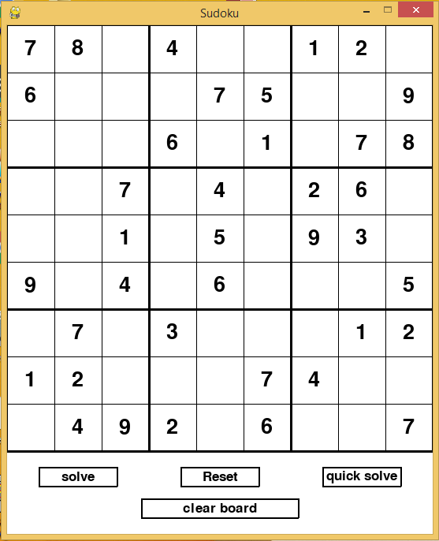
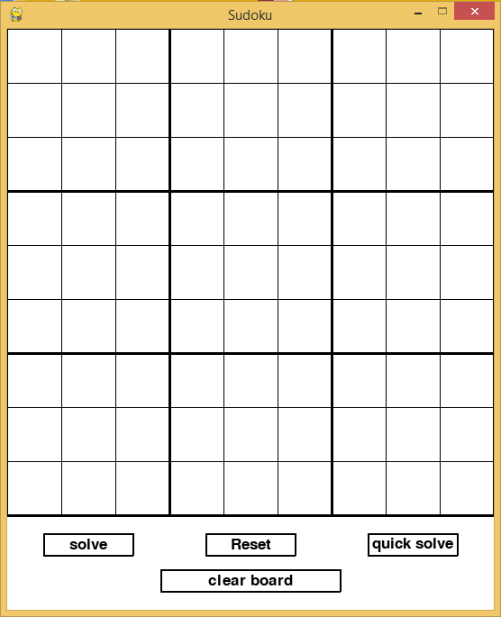

# sudoku_solver
## screen shots

## list of buttons and its actions
* Clear board - clears the entire board
* Reset - Returns to default screen
* Solve - solves the grid
* quick - solves quickly

[demo](https://user-images.githubusercontent.com/69081173/123045030-11ed4c80-d418-11eb-8a5a-d1c4b32eb02a.mp4)
